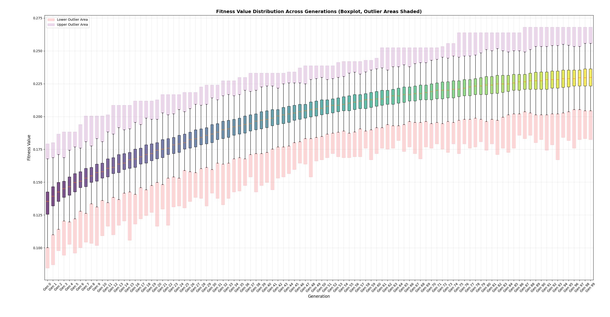
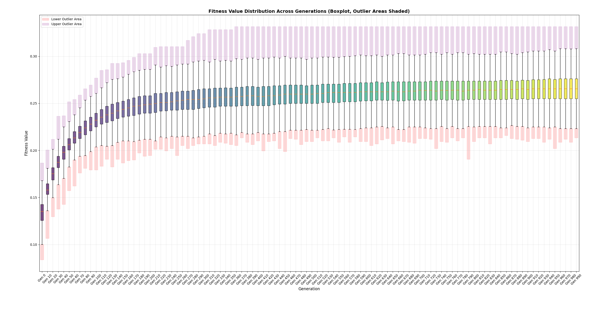
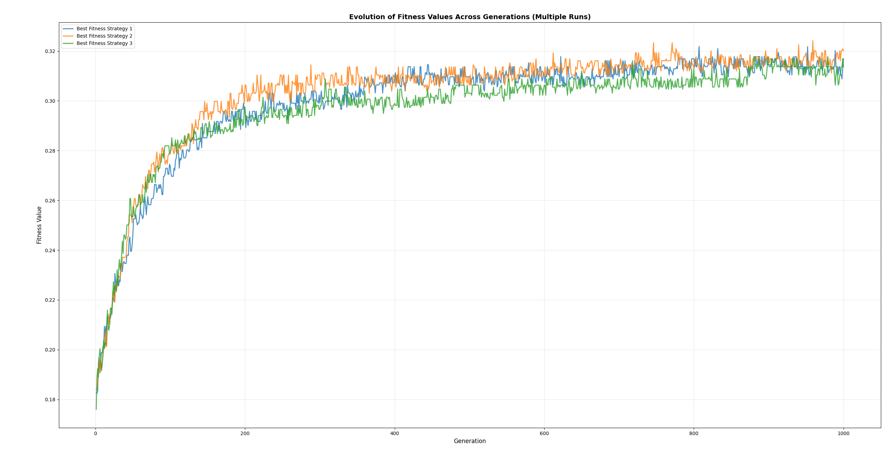
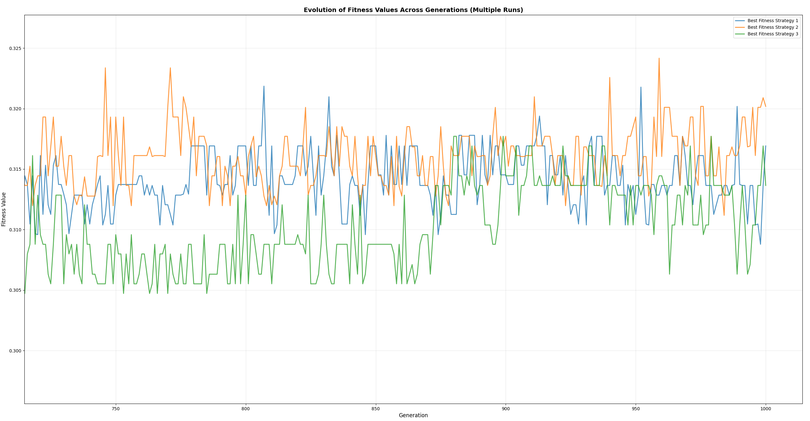
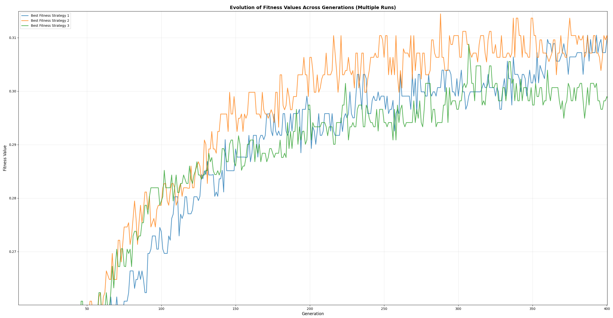
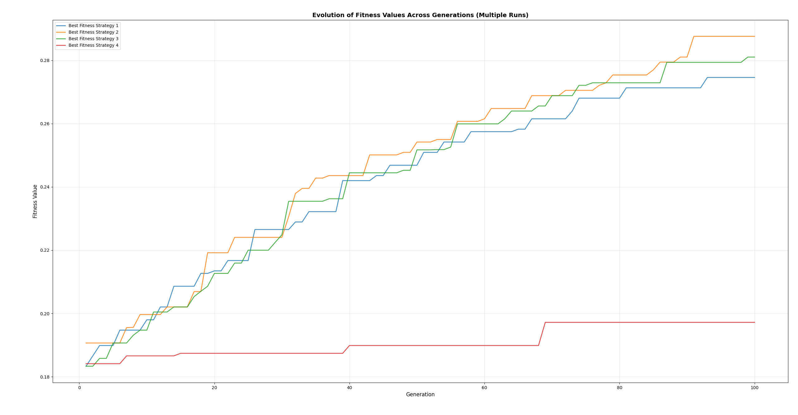
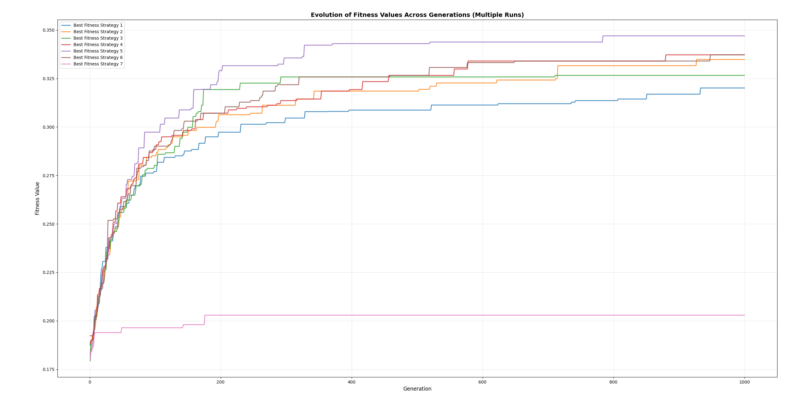

# Informe Proyecto IA I
# Music Track Mixer

## Índice

1. [Introducción](#introducción)

2. [Marco Teórico](#marco-teórico)
   - 2.1. [Algunos Fundamentos de Teoría Musical](#1-algunos-fundamentos-de-teoría-musical)
     - 2.1.1. [Elementos Básicos de la Música](#11-elementos-básicos-de-la-música)
     - 2.1.2. [Representación de Alturas Musicales](#12-representación-de-alturas-musicales)
     - 2.1.3. [Intervalos y Tonos Relativos](#13-intervalos-y-tonos-relativos)
   - 2.2. [Protocolo MIDI](#2-protocolo-midi)
   - 2.3. [Algoritmos Genéticos](#3-algoritmos-genéticos)
     - 2.3.1. [Representación de Individuos](#31-representación-de-individuos)
     - 2.3.2. [Inicialización de la Población](#32-inicialización-de-la-población)
     - 2.3.3. [Función de Fitness](#33-función-de-fitness)
     - 2.3.4. [Operadores de Selección](#34-operadores-de-selección)
       - 2.3.4.1. [Selección por Elitismo](#341-selección-por-elitismo)
       - 2.3.4.2. [Selección para Reproducción](#342-selección-para-reproducción)
     - 2.3.5. [Operadores de Recombinación](#35-operadores-de-recombinación)
       - 2.3.5.1. [Recombinación de Un Punto (Estrategia 1)](#351-recombinación-de-un-punto-estrategia-1)
       - 2.3.5.2. [Recombinación de Dos Puntos (Estrategia 2)](#352-recombinación-de-dos-puntos-estrategia-2)
       - 2.3.5.3. [Recombinación de Tres Puntos (Estrategia 4)](#353-recombinación-de-tres-puntos-estrategia-4)
       - 2.3.5.4. [Recombinación de Cuatro Puntos (Estrategia 5)](#354-recombinación-de-cuatro-puntos-estrategia-5)
       - 2.3.5.5. [Estrategias Mixtas](#355-estrategias-mixtas)
     - 2.3.6. [Operador de Mutación](#36-operador-de-mutación)
     - 2.3.7. [Reemplazo Generacional](#37-reemplazo-generacional)
     - 2.3.8. [Criterio de Terminación](#38-criterio-de-terminación)
     - 2.3.9. [Algoritmo Completo](#39-algoritmo-completo)
   - 2.4. [Normalized Compression Distance](#4-normalized-compression-distance)

3. [Diseño Experimental](#diseño-experimental)

4. [Análisis de Resultados](#análisis-de-resultados)

5. [Conclusión](#conclusión)

6. [Bibliografía](#bibliografía)

## Introducción

El presente proyecto tiene como principal objetivo evaluar el rendimiento de un algoritmo genético para generar piezas musicales, más específicamente, para crear nuevas composiciones musicales partiendo de un determinado número de pistas de entrada, y que estas nuevas creaciones evoquen de alguna forma aspectos musicales de las piezas originales.

La aplicación de algoritmos de machine learning al campo de la música ha resultado de interés a lo largo de mucho tiempo, debido en primer lugar a la dificultad de lograr capturar todos los patrones y sutilezas que residen en una composición musical, ya sea con el fin de crear nuevas composiciones o de clasificar grupos de canciones ya existentes según género, intérprete, tipo de instrumentos, etc., y por otro lado debido también a lo subjetivo que puede resultar valorar las cualidades musicales de una determinada pieza. Actualmente, y de acuerdo a lo investigado, la gran mayoría de soluciones aplicadas a este campo se apoyan principalmente en la utilización de algoritmos de aprendizaje profundo para extraer características y patrones musicales, obteniendo resultados destacables. Sin embargo, dado que este tipo de algoritmos conllevan un costo computacional muy alto, resulta interesante considerar la posibilidad de aplicar otro tipo de algoritmos para este fin, y es por eso que para este trabajo en particular se propone entonces la utlización de un algoritmo genético.

En las siguientes secciones se amplía acerca de los fundamentos teóricos (tanto musicales como algorítmicos) necesarios para entender el funcionamiento del algoritmo y sus limitaciones, se presenta el diseño de los experimentos llevados adelante para evaluar su rendimiento junto con los resultados obtenidos y finalmente se analizan estos resultados y se comenta respecto de posibles mejoras o modificaciones.

## Marco Teórico

### 1. ALGUNOS FUNDAMENTOS DE TEORÍA MUSICAL

En el desarrollo de una pieza musical entran en juego diversos conceptos, entre los cuales podemos mencionar [1]:

### 1.1 Elementos Básicos de la Música

- **Melodía**: se define como la secuencia de notas musicales organizadas en el tiempo que forman una línea musical reconocible. Es la parte "cantable" de una pieza musical y generalmente constituye el elemento que más se recuerda. Una melodía se caracteriza por su contorno (dirección ascendente o descendente), intervalos entre notas y ritmo.

- **Armonía**: hace referencia a aquellas notas que se ejecutan de forma simultánea y que dan forma a los acordes y las progresiones armónicas. Proporciona el contexto tonal y el soporte estructural para la melodía.

- **Ritmo**: constituye la organización temporal de los sonidos musicales, incluyendo la duración de las notas, patrones rítmicos y el pulso.

- **Timbre**: se define como la cualidad del sonido que permite distinguir entre diferentes instrumentos o voces, incluso cuando tocan la misma nota.

### 1.2 Representación de Alturas Musicales

En el sistema musical occidental, las alturas se organizan en octavas, donde cada octava contiene 7 tonos y 12 semitonos. La nomenclatura de las notas en este sistema es la siguiente:

- **Notación tradicional**: Do, Re, Mi, Fa, Sol, La, Si
- **Notación anglosajona**: C, D, E, F, G, A, B
- **Representación numérica**: cada semitono corresponde a un número entero

### 1.3 Intervalos y Tonos Relativos

Los **intervalos** son las distancias entre dos notas musicales, medidas en semitonos. Los tonos relativos representan las diferencias de altura entre notas consecutivas. Por ejemplo, una secuencia melódica como C-D-E-F se puede representar como [+2, +2, +1] en semitonos, donde cada número indica la diferencia respecto a la nota anterior. Utilizar entonces tonos relativos en lugar de notas absolutas presenta las siguientes ventajas:

- **Invariancia tonal**: una melodía mantiene su identidad independientemente de la tonalidad en que se toque.
- **Reducción de espacio de búsqueda**: el algoritmo puede enfocarse en las relaciones melódicas sin preocuparse por la tonalidad absoluta.
- **Facilidad de transposición**: las melodías pueden transponerse fácilmente sumando una constante a todos los valores tonales.

### 1.4 Duraciones de las Notas Musicales

En notación musical, cada nota no solo tiene una altura (tono), sino también una duración específica, que indica cuánto tiempo debe sonar. Las duraciones básicas de las notas en la música occidental se representan mediante figuras, cada una con un valor relativo respecto al pulso o tiempo base (generalmente la negra):

- **Redonda**: equivale a 4 tiempos.
- **Blanca**: equivale a 2 tiempos.
- **Negra**: equivale a 1 tiempo.
- **Corchea**: equivale a 1/2 tiempo.
- **Semicorchea**: equivale a 1/4 de tiempo.
- **Fusa**: equivale a 1/8 de tiempo.
- **Semifusa**: equivale a 1/16 de tiempo.

Además, existen figuras con puntillo (que aumentan la duración de la nota en la mitad de su valor original) y ligaduras que permiten unir varias notas para prolongar su duración.

En los archivos MIDI empleados en el presente trabajo, la duración de cada nota se especifica en "ticks" o unidades de tiempo relativas al tempo de la pieza, permitiendo representar tanto duraciones estándar como valores intermedios o irregulares.

Siendo la intención simplemente describir brevemente este aspecto básico de la teoría musical para enfatizar su relevancia, resulta importante remarcar que el control de la duración de las notas es fundamental para definir el ritmo y la expresividad de una melodía, aunque en este proyecto se ha optado por trabajar en una primera etapa únicamente con la secuencia de alturas o tonos, omitiendo la variación en las duraciones para simplificar el análisis y la generación musical.

### 2. PROTOCOLO MIDI

El protocolo **MIDI** (Musical Instrument Digital Interface) permite comunicar instrumentos musicales electrónicos con computadoras y otros equipos similares. Fue desarrollado en la década de 1980 y se ha convertido actualmente en el estándar de facto para la representación digital de música, debido principalmente las siguientes características [9]:

- **Eficiencia de almacenamiento**: MIDI no almacena audio digitalizado, sino instrucciones sobre cómo tocar música. Esto resulta en archivos extremadamente pequeños comparados con formatos de audio.
- **Editabilidad**: los datos MIDI pueden modificarse fácilmente, permitiendo cambiar notas, instrumentos, tempo y otros parámetros sin degradación de calidad.
- **Separación de contenido**: se separa la información musical (qué tocar) de la síntesis de sonido (cómo suena), facilitando la manipulación algorítmica.
- **Precisión temporal**: se manejan tiempos con alta precisión, permitiendo representar ritmos complejos y matices temporales.

La información musical contenida en un archivo MIDI se representa mediante una serie de "mensajes" como los siguientes [9]:

- **Note On/Off**: especifica cuándo comienza y termina una nota, incluyendo:
    - Pitch (altura): número de 0 a 127, donde 60 representa el Do (o C) central
    - Velocity (velocidad): intensidad de ataque (0-127)
    - Channel (canal): permite hasta 16 instrumentos simultáneos
- **Program Change**: selecciona el instrumento o timbre a utilizar
- **Control Change**: modifica parámetros como volumen, modulación, etc.
- **Timing**: provee información temporal precisa sobre cuándo ocurren los eventos

Para el proyecto en particular, se utiliza la librería `pretty-midi` que abstrae muchos de estos parámentros, facilitando su manipulación.

### 3. ALGORITMO GENÉTICO

En el ámbito del machine learning, se conoce como "algoritmos genéticos" al tipo de algoritmos evolutivos que emplean técnicas de **búsqueda local** para encontrar soluciones a problemas de **optimización** y aprendizaje, inspirados en el proceso evolutivo de la **naturaleza**. [8]

Haciendo una analogía con el concepto biológico, entre los principales elementos de estos algoritmos encontramos entonces una **población** compuesta por un conjunto de **individuos** donde cada uno representa una posible solución codificada del problema. Estos últimos normalmente son alterados o modificados en distintas proporciones y siguiendo diferentes criterios, por medio de lo que se denomina "**operadores genéticos**", de los cuales podemos mencionar los de selección, entrecruzamiento o recombinación, mutación, fisión, elisión, entre otros. Como resultado de aplicar estos operadores a los individuos de una población se genera una nueva población, evolucionada, para la cual vuelve a repetirse el proceso de aplicación de operadores. Cada una de estas "nuevas poblaciones" recibe el nombre de **generación**, y la pieza clave encargada de evaluar la idoneidad de cada individuo entre generación y generación y guiar así todo el proceso evolutivo se denomina **función de aptitud o de fitness**. De esta manera, la evolución puede finalizar atendiendo a diversos criterios, siendo el principal el hecho de haber obtenido un valor deseado de aptitud, pero incluyendo también el haber alcanzado un número determinado de iteraciones o haber excedido un valor particular en el tiempo de ejecución del algoritmo. [8]

En líneas generales, podemos decir que el funcionamiento básico de este tipo de algoritmos se resume de la siguiente manera:

```
1. Se inicializa una población comunmente aleatoria
2. Se calcula el valor de fitness de cada individuo
3. Mientras no se cumpla el criterio de detención:
   a. Se seleccionan individuos para reproducción
   b. A una parte de estos se les aplica recombinación
   c. A otra parte mutación
   d. Se calcula el valor de fitness de los nuevos individuos
   e. Se seleccionan aquellos individuos que integrarán la próxima generación
4. Se retorna el mejor individuo 
```

#### 3.1 Representación de Individuos

En el contexto de este proyecto, cada individuo $I_i$ de la población representa una secuencia melódica codificada como un vector de tonos relativos:

$$I_i = [t_1, t_2, t_3, ..., t_n]$$

donde:
- $n$ es la longitud del individuo (50 o 75 tonos relativos según el experimento)
- $t_j \in [-20, 20]$ representa la diferencia tonal entre notas consecutivas
- $i \in [1, P]$ donde $P$ es el tamaño de la población (definido en 500 individuos como valor inicial de referencia)

Por ejemplo, un individuo de longitud 5 podría representarse como:
$$I_1 = [+2, -1, +3, -2, +1]$$

lo cual indica una melodía que sube 2 semitonos, baja 1, sube 3, baja 2 y sube 1, respectivamente.

#### 3.2 Inicialización de la Población

La población inicial $P_0$ se genera de forma aleatoria, donde cada tono relativo $t_j$ se inicializa siguiendo una distribución uniforme:

$$t_j \sim U(-20, 20)$$

Formalmente, la población inicial se define como:

$$P_0 = \{I_1, I_2, ..., I_P\}$$

donde cada $I_i$ se genera independientemente con componentes aleatorias en el rango anteriormente mencionado.

#### 3.3 Función de Fitness

La función de fitness $f(I_i)$ evalúa la aptitud de cada individuo basándose en su similitud con las melodías guía mediante la Normalized Compression Distance (NCD). Para un individuo $I_i$ y dos melodías guía $G_1$ y $G_2$, la función se define como:

$$f(I_i) = \frac{1}{2}[f_1(I_i) + f_2(I_i)]$$

donde:

$$f_k(I_i) = 1 - \text{NCD}(I_i, G_k)$$

y la NCD se calcula como:

$$\text{NCD}(x,y) = \frac{C(xy) - \min\{C(x), C(y)\}}{\max\{C(x), C(y)\}}$$

siendo $C$ el algoritmo de compresión utilizado y $xy$ la concatenación de las secuencias $x$ e $y$.

#### 3.4 Operadores de Selección

##### 3.4.1 Selección por Elitismo

Se aplica una estrategia de selección elitista donde se conservan los mejores individuos. Formalmente, si $P_t$ es la población en la generación $t$ ordenada por fitness descendente:

$$P_t = \{I_1, I_2, ..., I_P\} \text{ donde } f(I_1) \geq f(I_2) \geq ... \geq f(I_P)$$

Se elimina el 25% menos apto:

$$P_t^{selected} = \{I_1, I_2, ..., I_{\lfloor 0.75P \rfloor}\}$$

##### 3.4.2 Selección para Reproducción

Para la recombinación, se selecciona el 25% más apto de la población:

$$P_t^{reproduction} = \{I_1, I_2, ..., I_{\lfloor 0.25P \rfloor}\}$$

#### 3.5 Operadores de Recombinación

Los operadores de recombinación toman dos individuos padre y generan descendencia combinando sus características genéticas. Para cada estrategia, dados dos padres $x = [x_1, x_2, ..., x_n]$ y $y = [y_1, y_2, ..., y_n]$, se obtienen dos descendientes $o_1$ y $o_2$.

##### 3.5.1 Recombinación de Un Punto (Estrategia 1)

Se selecciona aleatoriamente un punto de corte $k \in [1, n-1]$:

$$o_1 = [x_1, x_2, ..., x_k, y_{k+1}, y_{k+2}, ..., y_n]$$
$$o_2 = [y_1, y_2, ..., y_k, x_{k+1}, x_{k+2}, ..., x_n]$$

**Ejemplo**: Para $x = [2, -1, 3, -2, 1]$, $y = [1, 2, -1, 3, -2]$ y $k = 2$:
$$o_1 = [2, -1, -1, 3, -2]$$
$$o_2 = [1, 2, 3, -2, 1]$$

##### 3.5.2 Recombinación de Dos Puntos (Estrategia 2)

Se seleccionan dos puntos de corte $k_1, k_2$ con $k_1 < k_2$:

$$o_1 = [x_1, ..., x_{k_1}, y_{k_1+1}, ..., y_{k_2}, x_{k_2+1}, ..., x_n]$$
$$o_2 = [y_1, ..., y_{k_1}, x_{k_1+1}, ..., x_{k_2}, y_{k_2+1}, ..., y_n]$$

**Ejemplo**: Para los mismos padres con $k_1 = 1, k_2 = 3$:
$$o_1 = [2, 2, -1, -2, 1]$$
$$o_2 = [1, -1, 3, 3, -2]$$

##### 3.5.3 Recombinación de Tres Puntos (Estrategia 4)

Se seleccionan tres puntos de corte $k_1 < k_2 < k_3$:

$$o_1 = [x_1, ..., x_{k_1}, y_{k_1+1}, ..., y_{k_2}, x_{k_2+1}, ..., x_{k_3}, y_{k_3+1}, ..., y_n]$$
$$o_2 = [y_1, ..., y_{k_1}, x_{k_1+1}, ..., x_{k_2}, y_{k_2+1}, ..., y_{k_3}, x_{k_3+1}, ..., x_n]$$

##### 3.5.4 Recombinación de Cuatro Puntos (Estrategia 5)

Similar al patrón anterior, se seleccionan cuatro puntos de corte y se alternan los segmentos entre padres.

##### 3.5.5 Estrategias Mixtas

- **Estrategia 3**: Aplica recombinación de dos puntos durante el 20% inicial de generaciones, luego recombinación de un punto.
- **Estrategia 6**: Utiliza diferentes tipos de recombinación en fases: dos puntos (generaciones 1-200), tres puntos (201-500), un punto (501+).

#### 3.6 Operador de Mutación

El operador de mutación introduce variabilidad aleatoria en los individuos. Para cada individuo $I_i$, se selecciona aleatoriamente una posición $j \in [1, n]$ y se aplica:

$$I_i[j] = I_i[j] + \delta$$

donde $\delta \sim U(-2, 2)$ es una perturbación aleatoria.

**Ejemplo**: Si $I_i = [2, -1, 3, -2, 1]$, $j = 3$ y $\delta = 1$:
$$I_i^{mutated} = [2, -1, 4, -2, 1]$$

#### 3.7 Reemplazo Generacional

Luego de aplicar los operadores genéticos descriptos hasta el momento, se forma la nueva población $P_{t+1}$ mediante:

1. **Elitismo**: Se conservan los mejores individuos de $P_t$
2. **Descendencia**: Se agregan los individuos generados por recombinación (es decir, se recupera el 25% eliminado anteriormente)
3. **Mutación**: Se aplica mutación a toda la población resultante

Formalmente:
$$P_{t+1} = \text{mutate}(\text{elite}(P_t) \cup \text{offspring}(P_t^{reproduction}))$$

#### 3.8 Criterio de Terminación

El algoritmo termina cuando se alcanza el número máximo de generaciones $G_{max}$:

$$t = G_{max}$$

En los experimentos realizados, $G_{max} \in \{100, 1000, 1100\}$ dependiendo del experimento.

#### 3.9 Algoritmo Completo

El pseudocódigo del algoritmo genético completo se puede entonces formalizar como:

```
Entradas: G_1, G_2 (melodías guía), P (tamaño población), n (longitud individuo), G_max (generaciones)

1. t ← 0
2. P_t ← inicializar_poblacion_aleatoria(P, n)
3. Mientras t < G_max:
   a. Para cada I_i ∈ P_t: calcular f(I_i)
   b. P_t ← ordenar_por_fitness(P_t)
   c. P_selected ← seleccionar_elite(P_t, 0.75)
   d. P_reproduction ← seleccionar_mejores(P_t, 0.25)
   e. offspring ← aplicar_recombinacion(P_reproduction, estrategia)
   f. P_t ← P_selected ∪ offspring
   g. P_t ← aplicar_mutacion(P_t)
   h. t ← t + 1
4. Retornar mejor_individuo(P_t)
```

Concebido de esta manera, el algoritmo permite evaluar sistemáticamente diferentes estrategias de recombinación manteniendo constantes los demás parámetros del mismo, lo cual facilita el análisis comparativo del rendimiento de cada estrategia en el contexto específico de la generación musical.

### 4. NORMALIZED COMPRESSION DISTANCE

Como se mencionó previamente en la introducción, la parte tal vez más difícil de aplicar un análisis algorítmico al campo de la música resulta ser la de cómo definir lo que pueda llegar a ser una composición musical idónea o "más apta" que otra, ya que esto se presta a depender del punto de vista desde el cual una pieza musical pueda ser juzgada por un eventual oyente.

Para intentar construir una función de aptitud objetiva a fin de evitar entonces este grado de subjetividad inherente al tema en estudio, algunos investigadores optaron por experimentar con un concepto perteneciente al ámbito de la Teoría de la Información denominado **Normalized Information Distance** (NID) [2], cuya fórmula se define a continuación:

$$\text{NID}(x,y) = \frac{\max\{K(x|y), K(y|x)\}}{\max\{K(x), K(y)\}}$$

donde $K(x|y)$ es la complejidad condicional de Kolmogorov de la cadena $x$ dada la cadena $y$, y cuyo valor es la longitud del programa más corto (para alguna máquina universal) el cual al proporcionarle como entrada la cadena $y$ devuelve la cadena $x$. 

Desafortunadamente, y como se menciona en [2], acudiendo al problema de la detención de máquinas de Turing puede demostrarse que tanto las complejidades condicionales como incondicionales presentes en la fórmula anterior resultan ser funciones no computables, por lo cual en la práctica se utilizan aproximaciones a la complejidad de Kolmogorov empleando algoritmos de compresión ya existentes y computables (como gzip, bzip2, lz4, etc.) que dan lugar a la métrica llamada **Normalized Compression Distance** (NCD):

$$\text{NCD}(x,y) = \frac{C(xy) - \min\{C(x), C(y)\}}{\max\{C(x), C(y)\}}$$

donde:
- $C$ es un algoritmo de compresión determinado
- $C(x)$ es el tamaño comprimido de la cadena $x$ usando C
- $C(y)$ es el tamaño comprimido de la cadena $y$ usando C
- $C(xy)$ es el tamaño comprimido de la cadena concatenada $xy$ usando C

Si bien esta métrica no logra los resultados teóricamente óptimos de su versión no computable, se ha demostrado que en la práctica, y en algunas ocasiones combinándola con otras técnicas (como KNN, ver [2]), los resultados obtenidos al clasificar piezas musicales por género (además también de los resultados obtenidos con tareas de clustering más allá de la música) son muy satisfactorios, motivo por el cual se espera poder replicar estos resultados al utilizar la NCD como parte de la función de fitness de un algoritmo genético.

Considerando que aplicamos esta métrica entonces para evaluar el grado de similitud entre dos secuencias de tonos relativos $x$ e $y$, el valor obtenido puede interpretarse de la siguiente manera:

- **NCD ≈ 0**: Las secuencias son muy similares
- **NCD ≈ 1**: Las secuencias son completamente diferentes
- **NCD > 1**: Puede ocurrir debido a imperfecciones del algoritmo de compresión

Para su uso en la función de fitness, se opta por invertir la relación anterior, de forma que, a mayor valor de fitness (es decir, un valor de dicha función más cercano a uno), indique mayor similitud entre las secuencias y por lo tanto mayor valor de aptitud.

### 5. ALGORITMO DE COMPRESIÓN

En cuanto al algoritmo de compresión específico mencionado en el apartado anterior para calcular la NCD, basándonos en lo estudiado en [4] y [5] se llega a la conclusión de que LZ77 aventaja a otros algoritmos como LZ78 y COSIATEC en la compresión de datos secuenciales y en su eficiencia de implementación. LZ77 trabaja identificando y reemplazando repeticiones de cadenas de datos dentro de una ventana deslizante, lo que lo hace especialmente adecuado para flujos de datos donde los patrones repetitivos son frecuentes. En comparación, LZ78 genera un diccionario explícito de cadenas, lo que puede incrementar el uso de memoria y complejidad en la gestión del diccionario, especialmente en aplicaciones en tiempo real o con recursos limitados.

Por otro lado, algoritmos como COSIATEC están diseñados específicamente para la detección de patrones musicales y análisis estructural, pero no están optimizados para la compresión general de datos ni cuentan con implementaciones ampliamente soportadas y optimizadas para entornos de producción.

En cuanto a la implementación, la librería zlib fue elegida frente a alternativas como gzip o lz4 principalmente debido a que zlib ofrece una interfaz flexible y multiplataforma, permitiendo ajustar el nivel de compresión según las necesidades del proyecto en caso de necesitarlo. En la práctica, zlib implementa el algoritmo DEFLATE, basado en LZ77, el cual es ampliamente reconocido por su equilibrio entre velocidad y relación de compresión. Aunque gzip también utiliza DEFLATE, su enfoque está más orientado a la compresión de archivos completos y no ofrece la misma flexibilidad de integración en aplicaciones como zlib. Por su parte, lz4 prioriza la velocidad de compresión y descompresión, pero sacrifica el ratio de compresión, lo que puede resultar en archivos más grandes. [6]

En resumen, la elección de LZ77 y la librería zlib responde a la búsqueda de un algoritmo eficiente, ampliamente soportado, con buena relación entre velocidad y compresión, y fácil de integrar en aplicaciones modernas, superando en estos aspectos a LZ78, COSIATEC, gzip y lz4 para los objetivos específicos del proyecto.

## Diseño Experimental

### Métricas de Evaluación

Para determinar el rendimiento del algoritmo genético propuesto, se emplearon las siguientes métricas principales:

- **Mejor valor de fitness alcanzado**: se registra el mayor valor de fitness obtenido por la mejor solución de cada ejecución, lo que indica el grado de similitud máxima lograda respecto a las melodías guía.
- **Promedio y desviación estándar del fitness**: se calcula el promedio y la dispersión de los valores de fitness a lo largo de las ejecuciones para evaluar la estabilidad y robustez del algoritmo.
- **Tiempos de ejecución**: se mide el tiempo total y el tiempo promedio por ejecución para comparar la eficiencia computacional de cada estrategia.
- **Curvas de convergencia**: se grafican los valores de fitness a lo largo de las generaciones para analizar la velocidad de convergencia y el comportamiento evolutivo de las distintas estrategias.

Estas métricas buscan comparar objetivamente el desempeño de las diferentes variantes del algoritmo y analizar el impacto de los parámetros y operadores utilizados.

### Herramientas Utilizadas

El desarrollo y la experimentación del proyecto se realizaron utilizando las siguientes herramientas:

- **Lenguaje de programación**: Python 3.10
- **Librerías principales**:
    - `numpy`: para operaciones numéricas y manejo eficiente de arreglos.
    - `matplotlib`: para la generación de gráficos y visualización de resultados.
    - `pretty-midi`: para la manipulación y análisis de archivos MIDI.
    - `zlib`: para la compresión de secuencias y cálculo de la NCD.
    - `random`: para la generación de números aleatorios y selección de individuos.
    - `time`: para la medición de tiempos de ejecución.
- **Entorno de desarrollo**: VS Code.
- **Sistema operativo**: Windows 11

Estas herramientas permitieron implementar, ejecutar y analizar el algoritmo de manera eficiente, facilitando la experimentación y la obtención de resultados reproducibles.

### Detalle de los Experimentos Realizados

Para poner a prueba el rendimiento del algoritmo planteado se establecieron como punto de partida los siguientes lineamientos:

1. Sólo se trabaja con la melodía de los archivos musicales, dejando de lado aspectos como la armonía o el ritmo. Esto implica que, para un archivo MIDI en particular obtenido de internet, se debe inspeccionar el número de pistas incluídas en el mismo, quedándonos sólo con la parte melódica en caso de encontrar más de una pista.
2. Se omite alterar la duración de cada nota, trabajando únicamente con los tonos. Esto se debe a que, de acuerdo a lo investigado (ver [2]), si se modifica la duración de cada nota en una melodía sin afectar sus tonos, sigue siendo posible reconocer la melodía original (en otras palabras, la duración de cada nota no altera de forma sustancial la esencia de una melodía). Sin embargo esto no ocurre con el caso opuesto, es decir, al alterar los tonos de cada nota de una melodía manteniendo sus duraciones, se ha comprobado que la melodía deja de ser reconocible.
3. Cada individuo de la población consiste en una secuencia de diferencias tonales, es decir, se trabaja con tonos relativos y no absolutos.
4. Para guiar el proceso evolutivo, se toman como guía dos secuencias melódicas, de la misma longitud que los individios de la población. La función de fitness calcula entonces el valor de aptitud de cada individuo partiendo del valor de la NCD entre la secuencia tonal del individuo y la secuencia de la melodía guía, para cada secuencia guía, y ponderando estas distancias en partes iguales según el número de secuencias guía (en este caso, se utilizan 2 secuencias guía, por lo que cada valor de la NCD se multiplica por 0.5 para obtener el valor de aptitud final de un individuo).
5. La mutación se realiza eligiendo en forma aleatoria un valor puntual de la secuencia de tonos relativos del individuo, y adicionándole un valor también aleatorio en el rango [-2, 2].
6. La longitud de cada individuo es de 50 tonos relativos, y cada tono se inicializa en forma aleatoria con un valor en el rango [-20, 20].
7. Se utiliza un tamaño de población de 500 individuos.
8. Se ejecuta 30 veces cada proceso evolutivo con el objetivo de obtener resultados más representativos del rendimiento de una estrategia. Por ejemplo, si una estrategia se ejecuta a lo largo de 100 generaciones, se repite 30 veces cada proceso de 100 generaciones y se agregan los resultados de cada generación al final para su posterior evaluación.

A partir de estas disposiciones iniciales, se fue experimentando con distintos valores para algunos parámetros, puntualmente el número de individuos, el tamaño de la población y el número de generaciones.

A modo de recordatorio, la estrategia de evolución principal adoptada consiste en:
1. Inicializar una población en forma aleatoria.
2. Calcular el valor de fitness de cada individuo y ordenar la población en forma descendente de acuerdo a este valor.
3. Eliminar el 25% menos apto de individuos de la población.
4. Aplicar una estrategia de recombinación al 25% de los individuos más aptos, y agregar el resultado al resto de la población para sustituir el 25% eliminado en el paso anterior.
5. Aplicar mutación a todos los individuos.
6. Repetir desde el paso 2 hasta llegar al número de generaciones deseado.

Con el propósito de investigar la mejor relación entre exploración y explotación del algoritmo, se experimenta con distintas estrategias de recombinación, identificadas de la siguiente forma:

1. **Estrategia 1**: se utiliza siempre recombinación de un solo punto
2. **Estrategia 2**: se utiliza siempre recombinación de dos puntos
3. **Estrategia 3**: del total de generaciones a ejecutar, el primer 20% utiliza recombinación doble y el 80% restante recombinación simple 
4. **Estrategia 4**: se utiliza siempre recombinación de tres puntos
5. **Estrategia 5**: se utiliza siempre recombinación de cuatro puntos
6. **Estrategia 6**: las primeras 200 generaciones utilizan solo recombinación doble, entre las generaciones 201 y 500 se emplea solo recombinación triple, y de la generación 501 en adelante se aplica únicamente recombinación simple.
7. **Estrategia 7**: solución aleatoria (no emplea recombinación ni mutación, pero sí elitismo) 

A continuación se presentan las figuras con los resultados obtenidos:

<div align="center">

  
<b>Figura 1.</b> Ejecución de la estrategia número 1 (siempre recombinación simple) con 30 ejecuciones de 100 generaciones cada una, donde cada generación está compuesta a su vez por 500 individuos con una longitud de 50 tonos relativos cada uno.
</div>

<div align="center">

  
<b>Figura 2.</b> Resultado de ejecutar 30 procesos de 1000 generaciones cada uno, donde cada generación consta de 500 individuos de 50 tonos relativos cada uno
</div>

<div align="center">

  
<b>Figura 3.</b> Diagrama de líneas de tendencia comparando el rendimiento de las distintas estrategias de recombinación, para 30 procesos de 1000 generaciones cada uno, donde cada generación consta de 500 individuos de 50 tonos relativos cada uno
</div>

<div align="center">

  
<b>Figura 4.</b> Acercamiento a la parte final del proceso evolutivo representado en la Figura 4 (incluye desde la generación número 700 a la número 1000)
</div>

<div align="center">

  
<b>Figura 5:</b> Acercamiento a la parte inicial del proceso evolutivo representado en la Figura 4 (incluye desde la generación número 50 a la número 400)
</div>

<div align="center">

  
<b>Figura 6.</b> Muestra el rendimiento de cada estrategia como en la Figura 4, pero esta vez empleando elitismo (me quedo con las 2 mejores soluciones de cada generación) e incluyendo también a modo de comparación el rendimiento de una solución aleatoria (la cual no emplea ni recombinación ni mutación, pero si elitismo). Esta prueba consistió en 30 procesos de 100 generaciones cada uno (no 1000), donde cada generación consta de 500 individuos de 50 tonos relativos cada uno
</div>

<div align="center">

  
<b>Figura 7.</b> Se agregan al experimento tres nuevas estrategias de recombinación (4, 5 y 6) y se incrementa la longitud de cada individuo a 75 tonos relativos (es decir, cada individuo crece un 50% en tamaño). Se ejecutan 30 procesos evolutivos de 1000 generaciones cada uno, con 500 individuos por población y 75 tonos relativos por individuo.
</div>

La siguiente es una tabla que permite visualizar los tiempos de ejecución de cada estrategia junto con el mejor valor de fitness obtenido:

<div align="center">

| Estrategia | Descripción | Mejor Fitness | Tiempo Total | Tiempo Promedio | Más Rápida | Más Lenta | Desv. Est. |
|:------------:|:----------------------------:|:--------------:|:-----------------:|:------------:|:-----------:|:------------:|:------------:|
| 1          | Recombinación simple       | 0.2746  | 234.75s      | 7.82s            | 7.37s      | 8.39s     | 0.21s      |
| 2          | Recombinación doble        | 0.2908  | 256.74s      | 8.56s            | 7.19s      | 13.97s    | 1.51s      |
| 3          | Recombinación mixta        | 0.2810  | 232.86s      | 7.76s            | 7.28s      | 8.29s     | 0.22s      |
| 4          | Solución aleatoria         | 0.1972  | 204.90s      | 6.83s            | 6.67s      | 7.25s     | 0.12s      |

<b>Tabla 1</b>

</div>


## Análisis de resultados


## Conclusión


## Bibliografía

[1] [Understanding Basic Music Theory](https://www.opentextbooks.org.hk/system/files/export/2/2180/pdf/Understanding_Basic_Music_Theory_2180.pdf)

[2] [A simple genetic algorithm for music generation by means of algorithmic information theory](https://www.researchgate.net/profile/Manuel-Alfonseca/publication/221008730_A_simple_genetic_algorithm_for_music_generation_by_means_of_algorithmic_information_theory/links/02e7e521b9152b11e4000000/A-simple-genetic-algorithm-for-music-generation-by-means-of-algorithmic-information-theory.pdf?_tp=eyJjb250ZXh0Ijp7ImZpcnN0UGFnZSI6ImluZGV4IiwicGFnZSI6InB1YmxpY2F0aW9uIn19)

[3] [Music Recombination using a Genetic Algorithm](https://scholarworks.indianapolis.iu.edu/bitstream/handle/1805/21281/Majumder_2019_music.pdf?isAllowed=y&sequence=1)

[4] [Using general-purpose compression algorithms for music analysis](https://vbn.aau.dk/files/223712009/rapport.pdf)

[5] [LZ77 Is All You Need? Why Gzip + KNN Works for Text Classification](https://blog.codingconfessions.com/p/lz77-is-all-you-need)

[6] [Compression: Clearing the Confusion on ZIP, GZIP, Zlib and DEFLATE](https://dev.to/biellls/compression-clearing-the-confusion-on-zip-gzip-zlib-and-deflate-15g1)

[7] [“Low-Resource” Text Classification: A Parameter-Free Classification Method with Compressors](https://aclanthology.org/2023.findings-acl.426.pdf)

[8] S. Russell and P. Norvig, Artificial Intelligence: A Modern Approach, 4th ed.

[9] [MIDI Protocol](https://en.wikipedia.org/wiki/MIDI)